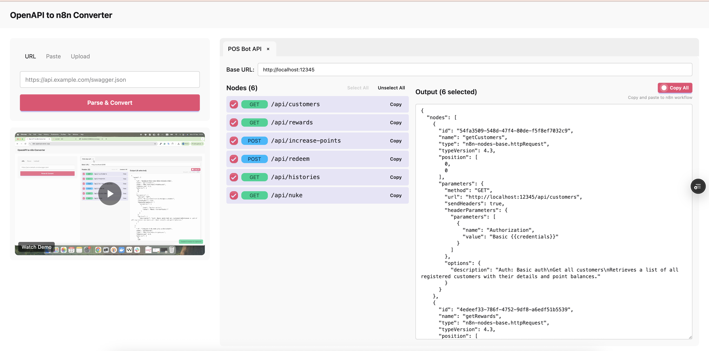

# OpenAPI to n8n Converter

Convert OpenAPI/Swagger specs into n8n HTTP Request nodes instantly.

**Live Demo:** https://n8n-openapi.vercel.app

## Features

- **OpenAPI 3.x & Swagger 2.0** - JSON and YAML supported
- **Multiple inputs** - Fetch from URL, paste, or upload file
- **Select endpoints** - Pick only the nodes you need
- **Edit base URL** - Override API host as needed
- **One-click copy** - Paste directly into n8n workflow
- **Multi-tab** - Work with multiple APIs at once
- **Auto-save** - Conversions persist in browser

## How to Use

1. Enter your OpenAPI spec (URL, paste, or upload)
2. Click **Parse & Convert**
3. Select the endpoints you want
4. Click **Copy All** and paste into n8n

## License

MIT
